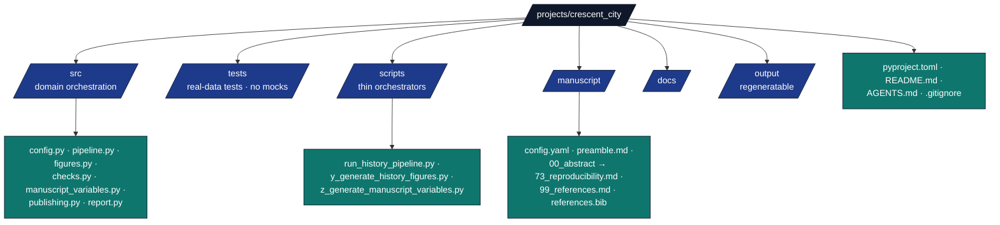

# crescent_city — Agent Guide

## Purpose

Historical research exemplar demonstrating a comprehensive, cited history of
Crescent City, California. The manuscript is organized around the nested
systems lenses of Space, Time, People, and Ideas, with deterministic figures,
local citation checks, and reproducible PDF rendering.

## Layout



## Directory-level guides

| Directory | What to read before editing |
|---|---|
| `data/` | [`data/README.md`](data/README.md), [`data/AGENTS.md`](data/AGENTS.md) |
| `docs/` | [`docs/README.md`](docs/README.md), [`docs/AGENTS.md`](docs/AGENTS.md) |
| `manuscript/` | [`manuscript/README.md`](manuscript/README.md), [`manuscript/AGENTS.md`](manuscript/AGENTS.md), [`manuscript/SYNTAX.md`](manuscript/SYNTAX.md) |
| `scripts/` | [`scripts/README.md`](scripts/README.md), [`scripts/AGENTS.md`](scripts/AGENTS.md) |
| `src/` | [`src/README.md`](src/README.md), [`src/AGENTS.md`](src/AGENTS.md) |
| `src/_figures/` | [`src/_figures/README.md`](src/_figures/README.md), [`src/_figures/AGENTS.md`](src/_figures/AGENTS.md) |
| `tests/` | [`tests/README.md`](tests/README.md), [`tests/AGENTS.md`](tests/AGENTS.md) |

## Key contracts

* `src/config.py::ProjectConfig` — every editorial-policy knob is here.
  Edit `ProseAnalysisConfig` to add a new prose gate, parse it in
  `from_dict`, then wire it into `src.pipeline.run_pipeline`.
* `src/checks.py::CheckResult` — shared validation result record used by
  the pipeline and review report.
* `src/pipeline.py::run_pipeline` — reads manuscript via
  `infrastructure.prose`, cross-checks citations, generates figures,
  and returns an exit code.
* `src/pipeline.py::run_figures_only` — generates figures without prose
  or bibliography checks.
* `src/figures.py` — matplotlib public API; the registry records figure
  plotters and any project-local data files they need.
* `src/manuscript_variables.py` — derives substitution variables from the JSON
  report; no Crescent City-specific knowledge embedded.
* `src/report.py::write_review_report` — assembles the markdown review.
* `data/historical_events.json` — chronology source of truth; every row carries
  source keys, date precision, evidence type, and audit status so current
  claims can be refreshed without rewriting prose first.
* `docs/sources_provenance_ethics.md` — source-tier definitions, provenance
  requirements, reuse expectations, and sensitive-material boundaries.
* `docs/data_validation_qa.md` — executable data-QA map and planned checks
  that are not yet release gates.

## Run modes

| Command | Behavior |
|---|---|
| `python scripts/run_history_pipeline.py` | Default config; reads `manuscript/`, writes everything. |
| `… --strict` | Exit non-zero if any check fails. |
| `… --figures-only` | Generate the 24 PNG/SVG figure pairs only. |
| `… --config other.yaml` | Use an alternative config file. |
| `… --project-root path` | Run against an isolated project root. |

## Testing

```bash
uv run pytest projects/crescent_city/tests/ -v
```

All tests run offline. Real prose inputs, real BibTeX files, real
`tmp_path` directories, real subprocess invocation of the scripts. No
mocks.

## How this project differs from its siblings

* `template_code_project` — has its own algorithm (`src/optimizer.py`)
  and generates figures from numerical experiments.
* `template_search_project` — runs literature search and *populates*
  `manuscript/references.bib` from a query.
* `crescent_city` — carries a hand-curated scholarly narrative whose
  cited-key and bibliography counts are measured by each pipeline run.
  The "experiment" is the editorial-review pipeline applied to a dense
  historical manuscript.

## Extending

To add a new check:

1. Edit `src/config.py::ProseAnalysisConfig` to add the new field.
2. Add a `_check_<name>` helper or inline `CheckResult` block in
   `src/pipeline.py`.
3. Wire it into `run_pipeline` so it appears in `output/pipeline_report.json`.
4. Add a test in `tests/test_pipeline.py` covering both `passed=True`
   and `passed=False` outcomes.
5. Optionally surface its result in `src/report.py::write_review_report`.

To add a new figure:

1. Add a `plot_<name>` function in the appropriate `src/_figures/` module.
2. Re-export it from `src/figures.py`.
3. Add a `FigureSpec` to `FIGURE_REGISTRY`, including `data_inputs` when
   the plotter reads `data/`.
4. Update `manuscript/A1_figure_catalogue.md` and any chapter that embeds
   the output PNG.
5. Update `README.md`, `docs/project_overview.md`, and relevant tests when
   the figure count or registry order changes.

## See also

* [`README.md`](README.md) — quick reference.
* [`docs/README.md`](docs/README.md) — documentation directory guide.
* [`docs/architecture.md`](docs/architecture.md) — module dependency graph.
* [`docs/quickstart.md`](docs/quickstart.md) — getting started.
* [`docs/data_dictionary.md`](docs/data_dictionary.md) — data schema and provenance guide.
* [`docs/sources_provenance_ethics.md`](docs/sources_provenance_ethics.md) — source tiers, provenance, reuse, and ethics boundaries.
* [`docs/data_validation_qa.md`](docs/data_validation_qa.md) — current data validation and QA scope.
* [`docs/figure_maintenance.md`](docs/figure_maintenance.md) — figure registry and caption contract.
* [`docs/manuscript_authoring.md`](docs/manuscript_authoring.md) — manuscript editing workflow.
* [`docs/testing_and_quality.md`](docs/testing_and_quality.md) — test matrix and quality semantics.
* [`docs/environment_reproducibility.md`](docs/environment_reproducibility.md) — environment setup and reproduction commands.
* [`docs/audit_trail_limitations.md`](docs/audit_trail_limitations.md) — audit trail and known limits.
* [`docs/accessibility_reader_experience.md`](docs/accessibility_reader_experience.md) — reader-facing accessibility and spot checks.
* [`docs/release_archival_versioning.md`](docs/release_archival_versioning.md) — release, archival, and correction policy.
* [`infrastructure/prose/AGENTS.md`](../../infrastructure/prose/AGENTS.md) —
  underlying prose-analysis API.
* [`infrastructure/reference/AGENTS.md`](../../infrastructure/reference/AGENTS.md) —
  bibliography validation API.
