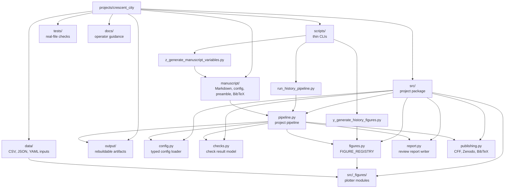
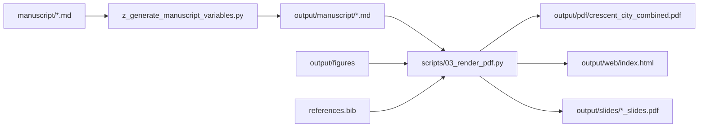

# Architecture

`crescent_city` is a prose-heavy research exemplar inside the template
repository. It keeps hand-authored manuscript and data sources separate
from project logic, thin CLI orchestration, generated artifacts, and
project documentation.

The core rule is simple: source truth lives in `manuscript/`, `data/`,
`src/`, `scripts/`, and checked-in docs. `output/` is rebuildable.

## System Map



## Boundaries

| Layer | Location | Contract |
|---|---|---|
| Manuscript source | `manuscript/` | Hand-authored Markdown, config, preamble, and bibliography |
| Data source | `data/` | Small checked-in source tables with provenance fields |
| Domain code | `src/` | Importable project library; no CLI argument parsing |
| Figure modules | `src/_figures/` | Plotters save PNG outputs and SVG siblings through shared helpers |
| Orchestrators | `scripts/` | CLI parsing and calls into `src/`; no business logic |
| Tests | `tests/` | Real file I/O and subprocess coverage; no mocks |
| Documentation | `README.md`, `AGENTS.md`, `docs/`, folder guides | Public overview, local contracts, runbooks, and drift guards |
| Artifacts | `output/` | Rebuildable reports, figures, PDFs, HTML, slides, and metadata |

## Two Pipelines

The project has a project pipeline and a shared rendering pipeline. They
serve different purposes and should both be used before publication.

| Pipeline | Command | Purpose | Primary outputs |
|---|---|---|---|
| Project quality pipeline | `PYTHONPATH=. uv run python projects/crescent_city/scripts/run_history_pipeline.py --strict` | Analyze prose, check citations and headings, generate figures, write review and publication metadata | `projects/crescent_city/output/pipeline_report.json`, `review_report.md`, `figures/`, `CITATION.cff` |
| Shared renderer | `PYTHONPATH=. uv run python scripts/03_render_pdf.py --project crescent_city` | Hydrate manuscript variables and render combined PDF, combined HTML, per-section HTML, and slides | `projects/crescent_city/output/pdf/crescent_city_combined.pdf`, `web/index.html`, `slides/` |

Validation and copy-out are separate repository-level stages:

```bash
PYTHONPATH=. uv run python scripts/04_validate_output.py --project crescent_city
PYTHONPATH=. uv run python scripts/05_copy_outputs.py --project crescent_city
```

## Project Pipeline Flow

`scripts/run_history_pipeline.py` is the CLI entry point. Internally it
calls:

1. `src.config.load_project_config()` for `manuscript/config.yaml`.
2. `infrastructure.prose.report.analyze_manuscript()` for prose metrics.
3. Local `CheckResult` gates for grade band, citation density, heading
   levels, section cross-references, and BibTeX consistency.
4. `src.figures.generate_all_figures()` for the 24-figure suite.
5. `src.report.write_review_report()` for the human-readable review.
6. `src.publishing.write_publishing_artifacts()` for citation metadata.

`--figures-only` calls `src.pipeline.run_figures_only()` and skips prose,
bibliography, review, and publishing stages.

## Rendering Flow

The shared renderer does not treat `manuscript/` as already publication
ready. It first runs manuscript-variable hydration and writes substituted
copies under `output/manuscript/`. It then renders from that hydrated
directory.



Do not edit hydrated files in `output/manuscript/`. Edit the source
Markdown, variables script, data, or figure code instead.

## Data And Figure Flow

Facts that drive figures should live in `data/` unless they are explicitly
schematic geometry. Plotters in `src/_figures/` read those files and save
both a PNG and an SVG. The public registry in `src/figures.py` is the
operational contract for count, order, provenance fields, captions, long
descriptions, and plotter functions.

When adding or changing a figure:

1. Add or update source data in `data/` with `source_keys` or equivalent
   provenance fields.
2. Implement the plotter in `src/_figures/`.
3. Register it in `src/figures.py`.
4. Update `data/figure_provenance.csv`.
5. Update `manuscript/A1_figure_catalogue.md` and any manuscript image
   blocks or captions.
6. Run figure tests and the strict pipeline.

## Extension Points

| Change | Preferred location |
|---|---|
| New manuscript variable | `src/manuscript_variables.py` and `scripts/z_generate_manuscript_variables.py` |
| New data-backed figure | `data/`, `src/_figures/`, `src/figures.py` |
| New quality gate | `src/pipeline.py`, with tests in `tests/` |
| New publication metadata field | `manuscript/config.yaml` and `src/publishing.py` |
| New documentation contract | `docs/`, then `tests/test_documentation.py` if it should be guarded |

See `data_dictionary.md`, `figure_maintenance.md`,
`manuscript_authoring.md`, and `testing_and_quality.md` for the detailed
operator guides behind these extension points.

## Failure Boundaries

| Failure | Likely subsystem | Start here |
|---|---|---|
| Missing or stale figure | `data/`, `src/_figures/`, `src/figures.py` | `PYTHONPATH=. uv run pytest projects/crescent_city/tests/test_figures.py -q` |
| Broken citation | `manuscript/*.md`, `manuscript/references.bib` | `PYTHONPATH=. uv run pytest projects/crescent_city/tests/test_citations.py -q` |
| Render-only PDF problem | Hydrated manuscript, LaTeX preamble, shared renderer | `docs/rendering_and_outputs.md` |
| Stale current-event claim | `data/historical_events.json`, manuscript current chapters | `docs/source_refresh_workflow.md` |
| Documentation drift | `docs/`, root README/AGENTS, folder guides | `PYTHONPATH=. uv run pytest projects/crescent_city/tests/test_documentation.py -q` |

## Green Build Semantics

A green build means the artifact is structurally reproducible: files
exist, citations resolve, figures regenerate, checks pass, and render
outputs validate. It does not mean every historical or current-status
claim has been freshly reverified. For volatile claims, use
`claim_ledger.md` and `source_refresh_workflow.md` before public release.
